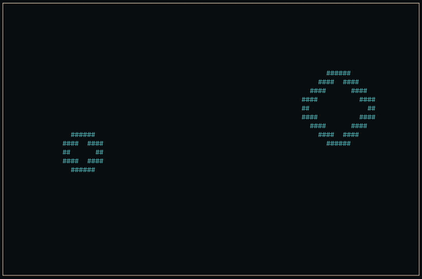

<div align="center"> 
  <h3>Terminal Game Engine</h3>
  <h1>Term Engine</h1>

[](#)
[](#)
[](https://github.com/yonnsdev/term-engine/wiki)

</div>

<div align="center">
  
  
  
</div>

## Installation

**Supported platforms: Linux, MacOS**

1. Clone repository

```
git clone https://github.com/yonnsdev/term-engine.git
```

2. Build using `make`

```
cd engine
make
```

3. Add to project

```
(example makefile)
INCFLAGS = -Ilibs/termengine
CFLAGS  += $(INCFLAGS)

LDFLAGS  = -lncurses
LDFLAGS += libs/termengine/engine.a
```

## Basic example

```c
#include "engine.h"

 windowClose();

int main() {
    initEngine();

    setViewport(30, 20);
    setColor();
    setBorder();

    while (!windowClose()) {
        clearViewport();

        drawCircle(15, 10, 5, 0, '#', COLOR_CYAN);

        renderViewport();
    }

    deinitEngine();
    return 0;
}

int windowClose() {
    int key = getKey();

    switch (key) {
        case KEY_SPACE:
            return 1;
        default:
            return 0;
    }
}
```

## Cheatsheet

```c
// Initialization
void initEngine();                                                              // Init engine
void deinitEngine();                                                            // Deinit engine

// Viewport
void setViewport(int width, int height);                                        // Create viewport w/parameters
void setColor();                                                                // Enable color rendering
void setBorder();                                                               // Enable viewport border
void renderViewport();                                                          // Render viewport to terminal
void clearViewport();                                                           // Clear viewport

// Time
void setTargetFPS(int fps);                                                     // Set target refresh rate (Recommend using default (12))
unsigned long getFrameCount();                                                  // Get frame count since program start (Resets to 0 after 4e+9)

// Draw
void drawPixel(int px, int py, char ch, int color);                             // Draw pixel "#"
void drawPoint(int x, int y, char ch, int color);                               // Draw point "##"
void drawText(int px, int py, char* text, int wrap, int color);                 // Draw text
void drawLine(int x1, int y1, int x2, int y2, char ch, int color);              // Draw line
void drawRectangle(int x, int y, int w, int h, int fill, char ch, int color);   // Draw rectangle
void drawRectangleT(Rectangle rect, int fill, char ch, int color);              // Draw rectangle with rectangle type
void drawCircle(int x, int y, int r, int fill, char ch, int color);             // Draw circle
void drawCircleT(Circle circ, int fill, char ch, int color);                    // Draw circle with circle type

// Collision
int checkCollisionPointRect(Vector2 point, Rectangle rect);                     // Check collision between point and rectangle
int checkCollisionPointCirc(Vector2 point, Circle circ);                        // Check collision between point and circle
int checkCollisionRects(Rectangle rect1, Rectangle rect2);                      // Check collision between two rectangles
int checkCollisionCircs(Circle circ1, Circle circ2);                            // Check collision between two circles

// Input
int getKey();                                                                   // Get pressed key
void flushInputBuf();                                                           // Flush input buffer

// Debug
void setDebug();                                                                // Enable debug menu
void addDebugAttrib(int line_num, char* title, char* value);                    // Add/Update debug attributes
```
