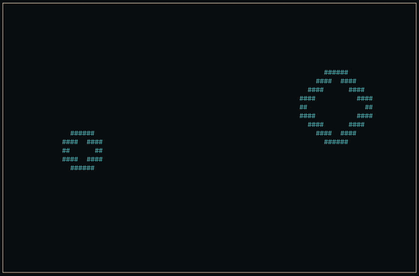

<div align="center"> 
  <h3>Terminal Game Engine</h3>
  <h1>Term Engine</h1>

[](#)
[](#)

</div>



## Installation

1. Clone repository

```
git clone https://github.com/yonnsdev/term-engine.git
```

2. Build using `make`

```
cd engine
make
```

3. Add to project

```
(example makefile)

INCFLAGS = -Iengine
LDFLAGS  = -lncurses
LDFLAGS += engine/engine.a
```

## Basic example

```c
#include "engine.h"

bool windowClose();

int main() {
    initEngine();

    setViewport(30, 20);
    setColor();
    setBorder();

    while (!windowClose()) {
        clearViewport();

        drawCircle(15, 10, 5, false, '#', COLOR_CYAN);

        renderViewport();
    }

    deinitEngine();
    return 0;
}

bool windowClose() {
    int key = getKey();

    switch (key) {
        case KEY_SPACE:
            return true;
        default:
            return false;
    }
}
```

## Cheatsheet

```c
// Initialization
void initEngine();                                                              // Init engine
void deinitEngine();                                                            // Deinit engine

// Viewport
void setViewport(int width, int height);                                        // Create viewport w/parameters
void setColor();                                                                // Enable color rendering
void setBorder();                                                               // Enable viewport border
void renderViewport();                                                          // Render viewport to terminal
void clearViewport();                                                           // Clear viewport

// Time
void setTargetFPS(uint16_t fps);                                                // Set target refresh rate (Recommend using default (12))
double getCurrentFPS();                                                         // Get current fps
unsigned int getClocktime();                                                    // Return clock time (milliseconds)

// Draw
void drawPixel(int precise_x, int precise_y, char ch, int color);               // Draw pixel "#"
void drawPoint(int x, int y, char ch, int color);                               // Draw point "##"
void drawLine(int x1, int y1, int x2, int y2, char ch, int color);              // Draw line
void drawCircle(int x, int y, int r, bool fill, char ch, int color);            // Draw circle
void drawCircleT(Circle circ, bool fill, char ch, int color);                   // Draw circle with circle type
void drawRectangle(int x, int y, int w, int h, bool fill, char ch, int color);  // Draw rectangle
void drawRectangleT(Rectangle rect, bool fill, char ch, int color);             // Draw rectangle with rectangle type

// Collision
bool checkCollisionPointRect(Vector2 point, Rectangle rect);                    // Check collision between point and rectangle
bool checkCollisionPointCirc(Vector2 point, Circle circ);                       // Check collision between point and circle
bool checkCollisionRects(Rectangle rect1, Rectangle rect2);                     // Check collision between two rectangles
bool checkCollisionCircs(Circle circ1, Circle circ2);                           // Check collision between two circles

// Input
int getKey();                                                                   // Get pressed key (ncurses)
void flushInputBuf();                                                           // Flush input buffer (ncurses)

// Debug
void setDebug();                                                                // Enable debug menu
void hideDebug();                                                               // Hide debug menu
void quitDebug();                                                               // Quit debug menu
void addDebugAttrib(int line_num, char* title, char* value);                    // Add/Update debug attributes
```
